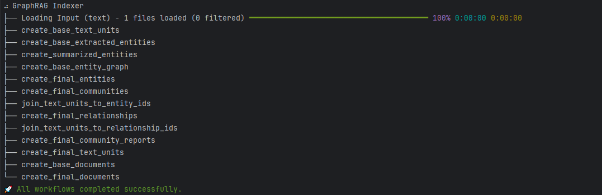
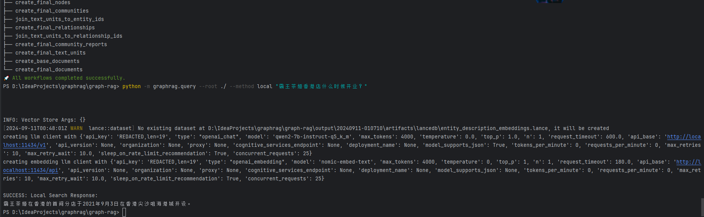
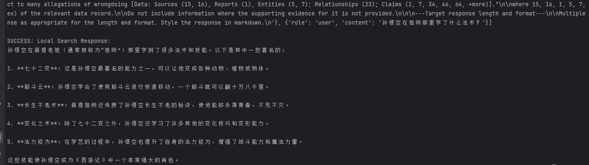
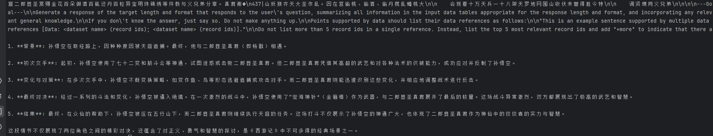
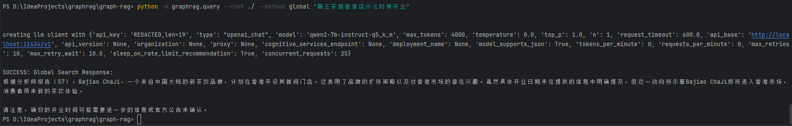

## ollama本地部署graph rag服务

### 1. 环境配置

#### 1.1 模型准备
```
pip install huggingface_hub
# hf镜像站
https://hf-mirror.com/
https://huggingface.co/Qwen/Qwen2-7B-Instruct-GGUF
# 下载model
huggingface-cli download Qwen/Qwen2-7B-Instruct-GGUF qwen2-7b-instruct-q5_k_m.gguf --local-dir ${YOUR_LOCAL_DIR} --local-dir-use-symlinks False
```

#### 1.2 构建ollama model

先准备一个Modelfile文件，用于ollama加载模型。

```
# Modelfile文件内容
FROM ${YOUR_LOCAL_DIR}/qwen2-7b-instruct-q5_k_m.gguf

PARAMETER temperature 1
PARAMETER num_ctx 4096
```
```
# 构建ollama model
ollama create qwen2-7b-instruct-q5_k_m -f ${你的Modelfile文件路径}
```

### 1.3 修改emb接口

我的代码已修改了如下两文件，基于「nomic-embed-text」做embedding

```
# 拉取「nomic-embed-text」embedding模型
ollama pull nomic-embed-text

# 如果你不是使用该模型，请修改文件中对应的模型名！！！
graphrag/llm/openai/openai_embeddings_llm.py
graphrag/query/llm/oai/embedding.py
```

测试emb接口是否正常

```
curl http://localhost:11434/api/embeddings -d '{
  "model": "nomic-embed-text",
  "prompt": "The sky is blue because of Rayleigh scattering"
}'
```

### 2. 初始化服务

如「graph-rag」目录作为测试，流程如下

```
mkdir graph-rag 
cd graph-rag

# 已修改源码去适配国产模型 故需先卸载官方的graphrag
pip uninstall graphrag
# 在仓库目录下执行 安装graphrag
pip install -v -e ./

# 初始化
python -m graphrag.index --init --root ./
```

### 3. 构造KG

graphrag测试文本如下：

[8家消费公司拿到新钱;霸王茶姬高薪招香港店长;一季度快消品平均售价同比降1.5%｜创投大视野.txt](https://new.qq.com/rain/a/20240629A021ZR00)

```
python -m graphrag.index --root ./ --resume 20240911-010710
```


### 4. 推理

```
python -m graphrag.query --root ./ --data ./output/20240911-010710/artifacts --method local "霸王茶姬香港店什么时候开业？"
```


python -m graphrag.query --root ./ --data ./output/20240928-021523/artifacts --method local "孙悟空在祖师那里学了什么法术？"



python -m graphrag.query --root ./ --data ./output/20240928-021523/artifacts --method local "总结一下孙悟空和二郎显圣真君的打斗？"



```
python -m graphrag.query --root ./ --data ./output/20240911-010710/artifacts --method global "霸王茶姬香港店什么时候开业"
```
